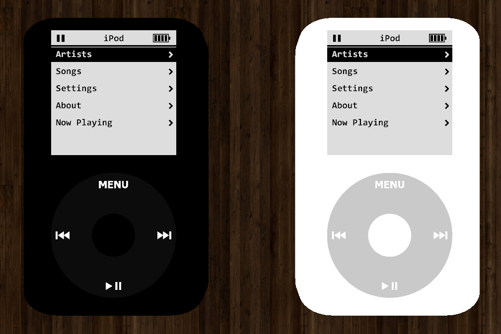

# gmod-ipod
iPod recreation made with Wiremod/Stream Radios/E2.

Fully featured (to be), honest to the original UI design. Based on the case design of the 4th/5th gen iPod classics. 

# Features
- Easy song management for Stream Radios
- Categorization of said songs
- Customizable colours and UI

# Requirements
- Wiremod  -  https://steamcommunity.com/sharedfiles/filedetails/?id=160250458
- Expression 2 Propcore extention (required for following chip, not required for normal function)
- SProps (for case/baseplate)  -  https://steamcommunity.com/sharedfiles/filedetails/?id=173482196
- Stream Radios  -  https://steamcommunity.com/sharedfiles/filedetails/?id=246756300

The advanced features/library of the stream radio are not required and are unused for compatibilities sake as most people do not have them.

# Todo
- Playlists
- iTunes 
- Expanded settings
- Statistics tracking (maybe. all private info, eg. song play count)
- Touch functionality of Click Wheel (if wireteam accepts my request for constant use output of EGP)
- Games (maybe)
- Build instructions/functional diagram (after full completion)

iPod, iTunes, and their designs are © Apple Inc.
